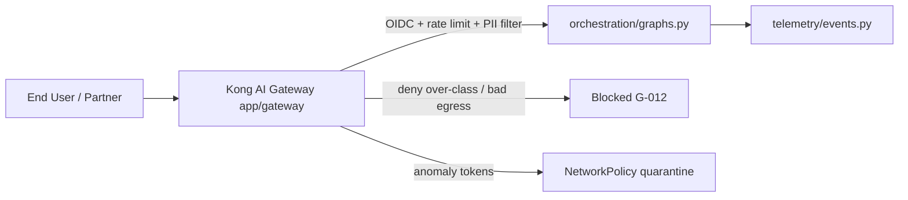

# STRIDE Worksheet — AI Gateway

**Component ID:** `01-ai-gateway`

## Code / infra under analysis (Phases 1–9)
- `app/gateway/gateway.py`
- `app/gateway/policies.yaml`

## Data-flow diagram

## STRIDE analysis

| Threat | AI/platform-specific risk | Mitigation in this build |
|--------|---------------------------|--------------------------|
| Spoofing | Forged service identity on gateway-agent channel | OIDC fail-closed; mTLS Gateway↔Agent (policies.yaml oidc-auth) |
| Tampering | Prompt injection payloads mutating downstream tool args | pre-function prompt filter; G-013 HITL for commit_recommendation |
| Repudiation | Operator deletes gateway access logs after misuse | WORM audit stream (G-018); TelemetryEvent append-only path |
| Information Disclosure | Response leaks higher-classification snippets | classification gate enforce_model_boundary; Trino OPA RLS |
| Denial of Service | Recursive agent loops exhaust gateway workers | Kong rate-limiting plugin (120/min); Karpenter HPA absorb |
| Elevation of Privilege | Plugin misconfig grants unauthenticated invoke | require X-End-User-Identity; deny missing identity |

## Residual risk summary

Shared plugin chain misconfiguration remains residual until Cloud-Integration plugin unit tests run against a live Kong DP.

> Assurance boundary (G-001): portfolio Design/Local evidence — not ATO.
