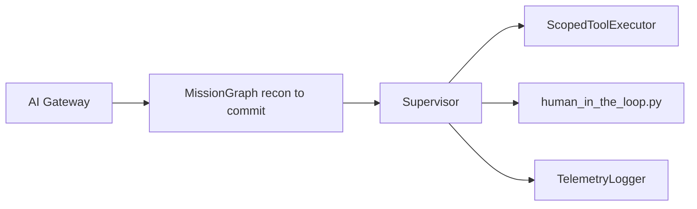

# STRIDE Worksheet — Orchestration layer

**Component ID:** `02-orchestration`

## Code / infra under analysis (Phases 1–9)
- `app/orchestration/graphs.py`
- `app/agents/supervisor.py`

## Data-flow diagram

## STRIDE analysis

| Threat | AI/platform-specific risk | Mitigation in this build |
|--------|---------------------------|--------------------------|
| Spoofing | Step runs under wrong agent_id | actor_id bound into G-013 digest |
| Tampering | Graph edge skipped to bypass HITL node | approve_commit node mandatory before commit edge |
| Repudiation | Step logs omitted for failed commits | telemetry.log_step on every run_step |
| Information Disclosure | Plan state leaks mission_id across tenants | tenant + mission_id on GraphState; OPA RLS downstream |
| Denial of Service | Unbounded graph cycles | Fixed edge map; no cyclic edges in MissionGraph |
| Elevation of Privilege | Non-HITL path invokes commit_recommendation | ScopedToolExecutor requires ApprovalToken when requires_hitl |

## Residual risk summary

Graph runner is a LangGraph-equivalent; residual until compiled LangGraph checkpointing is Cloud-Integration proven.

> Assurance boundary (G-001): portfolio Design/Local evidence — not ATO.
