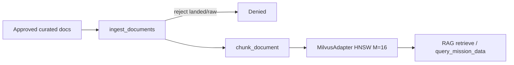

# STRIDE Worksheet — RAG pipeline

**Component ID:** `03-rag-pipeline`

## Code / infra under analysis (Phases 1–9)
- `app/rag/ingestion.py`
- `app/rag/chunking.py`
- `app/rag/milvus_adapter.py`

## Data-flow diagram

## STRIDE analysis

| Threat | AI/platform-specific risk | Mitigation in this build |
|--------|---------------------------|--------------------------|
| Spoofing | Unapproved dataset_version presented as active | ActiveDatasetPointer (G-014) for consumer resolve |
| Tampering | Poisoned chunks in vector index | Only curation_stage approved|active accepted |
| Repudiation | Upsert without dataset_version attribution | Chunk carries dataset_version; telemetry on retrieve |
| Information Disclosure | Cross-mission vector recall | Mission-scoped collections; Trino/OPA for mart joins |
| Denial of Service | efSearch too high starves nodes | Explicit HnswParams; NodePool limits |
| Elevation of Privilege | Landing-zone docs indexed | ingest_documents raises on non-curated stages |

## Residual risk summary

Local Milvus stand-in; recall/latency vs golden set still Local evidence only.

> Assurance boundary (G-001): portfolio Design/Local evidence — not ATO.
