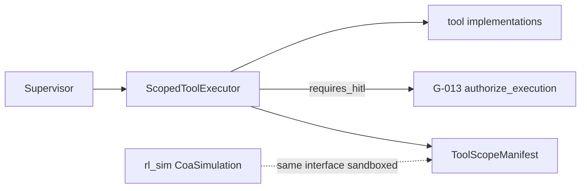

# STRIDE Worksheet — Tool-use layer

**Component ID:** `04-tool-use`

## Code / infra under analysis (Phases 1–9)
- `app/agents/tools.py`
- `app/tools/manifests/`
- `app/rl_sim/coa_simulation.py`

## Data-flow diagram

## STRIDE analysis

| Threat | AI/platform-specific risk | Mitigation in this build |
|--------|---------------------------|--------------------------|
| Spoofing | Tool invoked with spoofed actor_id | G-013 digest binds actor_id |
| Tampering | Argument substitution after approval | Canonical digest over exact_arguments |
| Repudiation | Tool call without agent identity log | TelemetryLogger + WORM (G-018) |
| Information Disclosure | resource_scope broader than manifest | allowed_resource_scopes enforced |
| Denial of Service | Parallel high-cost tool storms | max_concurrency on manifest; gateway rate limit |
| Elevation of Privilege | Code-exec escapes to node | sandbox-runtime NodePool + Kyverno deny privileged |

## Residual risk summary

gVisor/Kata RuntimeClass declared; live escape tests are Cloud-Integration.

> Assurance boundary (G-001): portfolio Design/Local evidence — not ATO.
