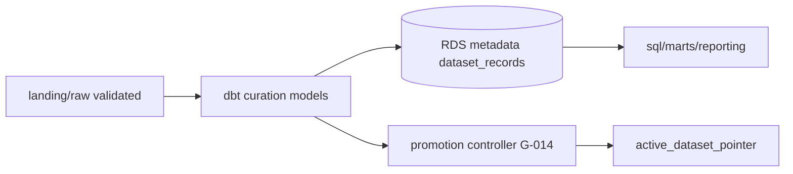

# STRIDE Worksheet — Data curation pipeline (incl. metadata DB)

**Component ID:** `05-data-curation`

## Code / infra under analysis (Phases 1–9)
- `app/data_pipelines/promotion/`
- `app/data_pipelines/db/models.py`
- `app/data_pipelines/sql/`

## Data-flow diagram

## STRIDE analysis

| Threat | AI/platform-specific risk | Mitigation in this build |
|--------|---------------------------|--------------------------|
| Spoofing | Falsified hitl_approval_status | HITL status transitions audited |
| Tampering | Poisoned quality_score / lineage (AML.T0043) | BI provenance panels; lineage reconcile playbook |
| Repudiation | Curation run without lakefs_commit_id | lakeFS hooks; TelemetryEvent |
| Information Disclosure | Replica serves unapproved stage | BI reads marts + replica only |
| Denial of Service | Full-table scans on facts | EXPLAIN CI gate; marts pre-aggregate |
| Elevation of Privilege | Partial promote leaves orphan active | Atomic pointer flip; fault-injection tests |

## Residual risk summary

Analytical-trust detection is Design+Local; live dashboard anomaly wiring is Cloud-Integration.

> Assurance boundary (G-001): portfolio Design/Local evidence — not ATO.
