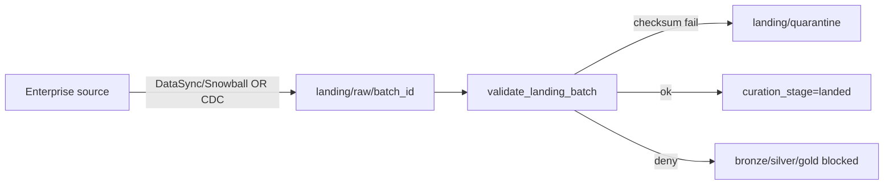

# STRIDE Worksheet — Enterprise data ingestion / connectivity boundary

**Component ID:** `06-enterprise-ingestion`

## Code / infra under analysis (Phases 1–9)
- `app/data_pipelines/ingestion/`
- `infra/terraform/modules/data-transfer/`

## Data-flow diagram

## STRIDE analysis

| Threat | AI/platform-specific risk | Mitigation in this build |
|--------|---------------------------|--------------------------|
| Spoofing | Rogue account assumes transfer role | Time-boxed read-only transfer IAM (tf module) |
| Tampering | Corrupted objects silently promoted | Checksum/count reconcile; quarantine |
| Repudiation | Transfer without batch audit | TransferBatch metadata + landed DatasetRecord |
| Information Disclosure | Transfer role writes curated zones | ObjectStore PermissionError on curated prefixes |
| Denial of Service | Unbounded bulk floods landing | Job windows; Karpenter pipeline-cpu limits |
| Elevation of Privilege | Ongoing path reuses bulk credentials overly broad | Separate bulk.py vs ongoing.py code paths |

## Residual risk summary

Live DataSync/Snowball cutover evidence remains Cloud-Integration (Section 15).

> Assurance boundary (G-001): portfolio Design/Local evidence — not ATO.
