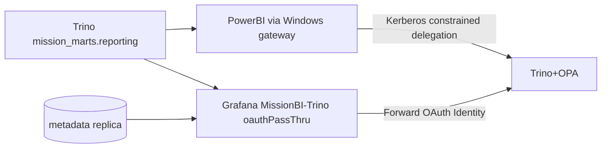

# STRIDE Worksheet — BI / reporting layer

**Component ID:** `07-bi-reporting`

## Code / infra under analysis (Phases 1–9)
- `analytics/bi_metrics.yaml`
- `analytics/grafana/`
- `analytics/powerbi/`
- `analytics/rls/`

## Data-flow diagram

## STRIDE analysis

| Threat | AI/platform-specific risk | Mitigation in this build |
|--------|---------------------------|--------------------------|
| Spoofing | Shared gateway service identity used for all viewers | G-004 Kerberos / oauthPassThru to real user |
| Tampering | Import-mode cache serves stale/poisoned mart | forbidImportMode in pbix.json defs |
| Repudiation | Dashboard edits without provenance | bi_metrics.yaml SSOT; folder RBAC Mission vs Infra |
| Information Disclosure | RLS bypass via native BI filters only | OPA primary RLS; analytics/rls sim proves distinct counts |
| Denial of Service | Heavy DirectQuery storms | Marts only; rate limits at Trino |
| Elevation of Privilege | PowerBI gateway as K8s workload | EC2 Windows cluster via ansible; no powerbi in k8s |

## Residual risk summary

Vendor-tenant failover and live dual-identity Trino audit proof is Cloud-Integration.

> Assurance boundary (G-001): portfolio Design/Local evidence — not ATO.
