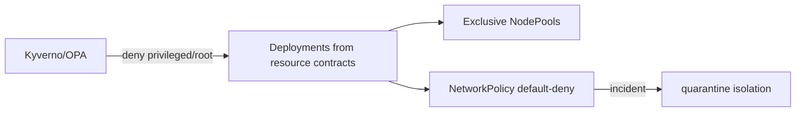

# STRIDE Worksheet — K8s / Karpenter control plane

**Component ID:** `08-k8s-karpenter`

## Code / infra under analysis (Phases 1–9)
- `infra/k8s/karpenter/nodepools.yaml`
- `infra/k8s/base/networkpolicies.yaml`
- `security/k8s-container-hardening/`

## Data-flow diagram

## STRIDE analysis

| Threat | AI/platform-specific risk | Mitigation in this build |
|--------|---------------------------|--------------------------|
| Spoofing | Pod scheduled onto wrong NodePool | nodeSelector + taints per workload-tier (G-016) |
| Tampering | Privileged pod escapes to node | Kyverno forbid privileged/root; RuntimeClass gVisor/Kata |
| Repudiation | Admission decisions not logged | Admission controller audit to G-018 |
| Information Disclosure | Cross-namespace east-west access | default-deny NetworkPolicies per namespace |
| Denial of Service | Mixed GPU/CPU pool waste / starvation | Mutually exclusive instance families |
| Elevation of Privilege | sandbox workload on gateway-general | sandbox-runtime exclusive pool + tolerations |

## Residual risk summary

Policy dry-run vs live API server rejection is Cloud-Integration.

> Assurance boundary (G-001): portfolio Design/Local evidence — not ATO.
