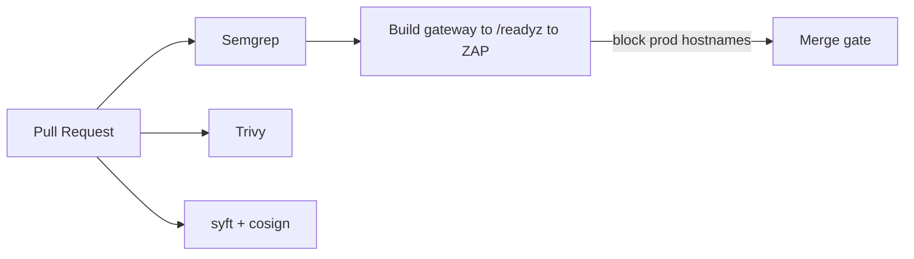

# STRIDE Worksheet — CI/CD pipeline

**Component ID:** `09-cicd-pipeline`

## Code / infra under analysis (Phases 1–9)
- `security/sast-sca-dast/`
- `.github/workflows/ (Phase 11)`

## Data-flow diagram

## STRIDE analysis

| Threat | AI/platform-specific risk | Mitigation in this build |
|--------|---------------------------|--------------------------|
| Spoofing | Unpinned Action replaced with malicious tag | SHA-pinned Actions (G-019) — Phase 11 YAML |
| Tampering | Poisoned dependency in lockfile | SCA exit-code 1 on CRITICAL/HIGH |
| Repudiation | Failed scan quietly continued | Jobs fail closed; required checks |
| Information Disclosure | DAST hits production hostname | Runner network policy hard-block prod hosts (G-015) |
| Denial of Service | Runner DoS via malicious workflow | permissions contents:read default |
| Elevation of Privilege | Privileged GITHUB_TOKEN overreach | Least-privilege job tokens |

## Residual risk summary

Full workflow YAML lands in Phase 11; this worksheet binds intended controls to the DAST design.

> Assurance boundary (G-001): portfolio Design/Local evidence — not ATO.
